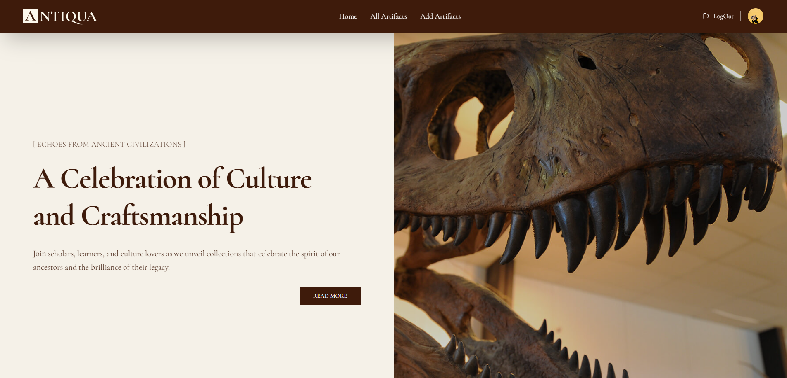

# 🏺 Historical Artifacts Tracker

## 🔎 Project Overview

> A responsive full-stack web application that allows users to submit, browse, and interact with historical artifacts. The platform supports user authentication, personalized dashboards, and an interactive like system to engage artifact enthusiasts.

---

## 📸 Screenshot



---

## 🛠 Technologies Used

- React.js (Frontend UI)
- Node.js & Express (Backend API)
- MongoDB (Database)
- Axios (HTTP client)
- Firebase Authentication (User auth and protected routes)
- Tailwind CSS (Styling)

---

## ✨ Core Features

- Stylish landing page with slider/banner, featured artifact cards, and informative sections.
- View all artifacts submitted by users on a dedicated page.
- Authenticated users can add new artifacts with details including name, image, and description.
- User Dashboard accessible via profile icon, showing:
  - Artifacts created by the user (My Artifacts)
  - Artifacts liked by the user (Liked Artifacts)
- Interactive like system allowing users to like or unlike artifacts; liked artifacts are saved per user.
- Firebase-based authentication with protected routes for adding artifacts, liking items, and accessing the user dashboard.

---

## ⚙️ Dependencies

- react, react-dom
- axios
- firebase
- react-router-dom
- express
- mongoose
- dotenv
- tailwindcss

---

## 🚀 How to Run Locally

1. **Clone the repository:**

   ```bash
   git clone https://github.com/Ik-Riyad/historical-artifacts-client.git
   cd your-repo-name

   ```

2. **Install frontend dependencies:**

- cd client
- npm install

3. **Install backend dependencies:**

- cd ../server
- npm install

4. **Setup environment variables:**

- Create .env files in both client and server directories.

- Add your MongoDB URI, Stripe keys, Firebase config, and other sensitive data.

5. **Start backend server:**

- npm run dev

6. **Start frontend app:**

- cd ../client
- npm start

7. **Open in browser:**

- Visit http://localhost:3000

## 🔗 Live Project

- [Live Project](https://candid-pika-b371d8.netlify.app/)

## 📬 Contact

- Reach me at: ik.riyad123@gmail.com
